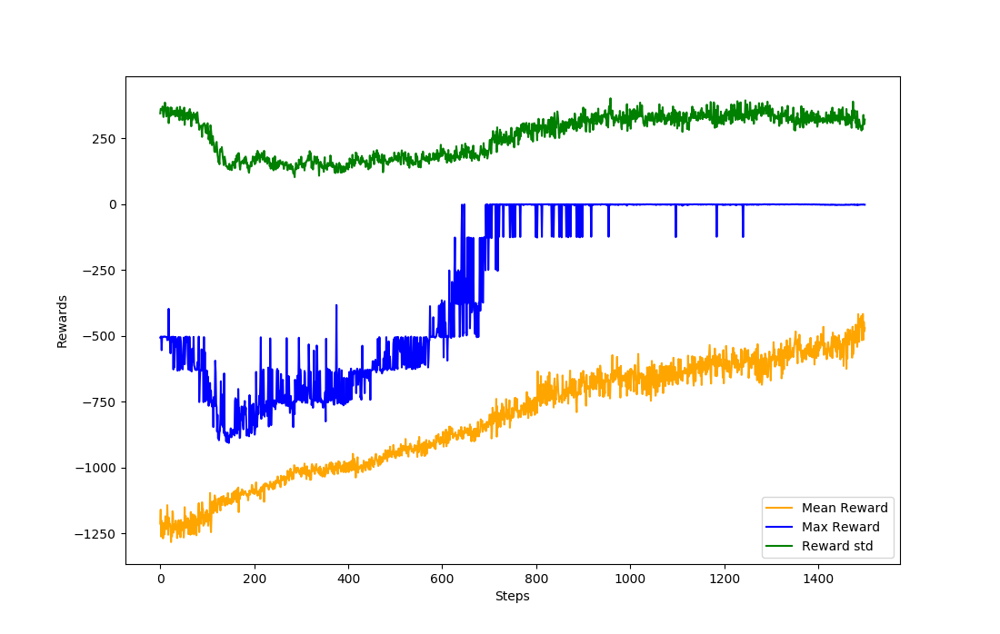

# Evolution Strategy algorithms

This folder contains 3 different Evolutionary Strategy algorithms:

- [ES_baseline_parallel.py](ES_baseline_parallel.py)

Baseline Evolution Strategy Algorithm for discrete action space that solves the CartPole environment.  
Code is based on this [Paper](https://arxiv.org/abs/1703.03864) and on this [book chapter](https://github.com/PacktPublishing/Deep-Reinforcement-Learning-Hands-On/tree/master/Chapter16)  
Written solely in numpy!

- [ES_dis_parallel_novelty.py](ES_dis_parallel_novelty.py)

Evolution Strategy algorithm for discrete action space with a novelty search for extra exploration. 
Code is based on [Paper EvoStrategy](https://arxiv.org/abs/1703.03864), [Paper novelty seeking agents](http://papers.nips.cc/paper/7750-improving-exploration-in-evolution-strategies-for-deep-reinforcement-learning-via-a-population-of-novelty-seeking-agents) and the [book chapter 16](https://github.com/PacktPublishing/Deep-Reinforcement-Learning-Hands-On/tree/master/Chapter16).
Written with pytorch.

- [ES_conti_parallel_novelty.py](ES_conti_parallel_novelty.py)

Evolution Strategy algorithm for continuous action space with a novelty search for extra exploration. 
Code is based on [Paper EvoStrategy](https://arxiv.org/abs/1703.03864), [Paper novelty seeking agents](http://papers.nips.cc/paper/7750-improving-exploration-in-evolution-strategies-for-deep-reinforcement-learning-via-a-population-of-novelty-seeking-agents) and the [book chapter 16](https://github.com/PacktPublishing/Deep-Reinforcement-Learning-Hands-On/tree/master/Chapter16).
Written with pytorch.

Evolution Strategies solving Pendulum:

