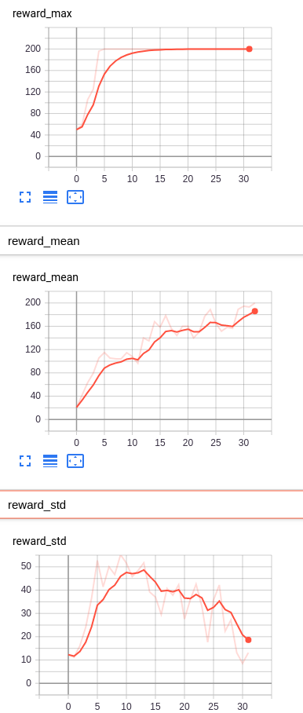

# Black-Box Optimization

### Evolution Strategy
#### Baseline implementation [ES_cartpole](https://github.com/BY571/Reinforcement-Learning/blob/master/Black-Box%20Optimization/Evolutionary_Strategies_Cartpole.ipynb)

### Genetic Algorithms

#### Baseline implementation [GA_cartpole](https://github.com/BY571/Reinforcement-Learning/blob/master/Black-Box%20Optimization/genetic_algorithm_base.py)
- run 'python genetic_algorithm_base.py' with the flags: `--noise`, `--ps`, `--pc` as:
    - `--noise`(std) that is added as the mutation of the neural network weights, default = 0.05
    - `--ps` as the population size, default = 50
    - `--pc` as the parents count or amount of top performer that build the new population, default = 10
    
Example performance with noise_std = 0.05, ps=30, pc=10

