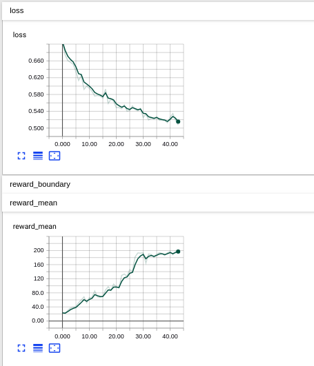

# Deep Reinforcement Leanring with Cross entropy
Cross entropy method implemented on the cart pole problem.
based on the example in the book [Deep Reinforcement Learning Hands-on](https://www.amazon.de/Deep-Reinforcement-Learning-Hands-Q-networks-ebook/dp/B076H9VQH6)  by Maxim Lapan

 
